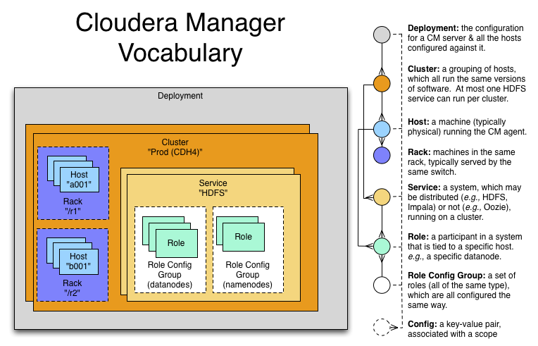

<!-- CSS work goes here for the time being -->
<!-- set a:link text-decoration to none -->
<!-- set a:hover text-decoration to underline -->
<!-- http://forums.markdownpad.com/discussion/143/include-pdf-pagebreak-instructions-in-markdown/p1 -->

---

# 
 <a name="cm_monitor_customize_section"/>CM Monitoring & Customizing

* <a href="#cm_overview">CM's vocabulary</a>
* <a href="#cm_search_bar">CM search bar features</a>
* <a href="#cm_users_roles">CM users and roles</a>
* <a href="#cm_commands_history">Recent commands and history</a>
* <a href="#cm_monitors">Monitoring services and resources</a>
* <a href="#cm_alerts">Adding Alerts</a>
* <a href="#cm_health_checks">Health checks</a>
* <a href="#cm_charting_time_series">Charting time-series data</a>
* <a href="#cm_property_settings">Managing property settings</a>
* <a href="#cm_api_sampler">Sample CM API calls</a>

<!-- material to add
* Wizards include
    * Express Install
    * Add Service/Role
    * Upgrade CDH
    * Enable HA (NameNode, Oozie, YARN RM)
* Some useful things are less visible
    * <code><i>Service</i>->Instances->Add Role Instances->View By Host</code> (button)
-->

---

## 
 <a name="cm_overview"/>CM Overview

  

---

## 
 Cloudera Manager Server Implementation

* Written in Java
* Closed-source
  * Hooks & client APIs are [published here](https://cloudera.github.io/cm_api/)
* Resources:
  * C5: `/usr/share/cmf`
  * C6: `/opt/cloudera/cm`
* Database initialization scripts:
  * C5: `/usr/share/cmf/schema`
  * C6: `/opt/cloudera/cm/schema`
* Command-line start parameters: `/etc/default/cloudera-scm-server`

---

## 
 Cloudera Manager Agent Implementation

* Written in Python
* Configuration file: `/etc/cloudera-scm-agent/config.ini`
* Resources:
  * C5: `/usr/lib64/cmf/agent`
  * C6: `/opt/cloudera/cm-agent`
* Process control: `/var/run/cloudera-scm-agent`
  * Configuration files for CDH services are located under `process/`
* Uses [supervisord](http://supervisord.org/) for process control

---

## 
 Notes on Cloudera Manager vocabulary

* [Philip Zeyliger's blog article on CM's design and operation](http://blog.cloudera.com/blog/2013/07/how-does-cloudera-manager-work/)  
* CM uses [service descriptors](https://github.com/cloudera/cm_ext/wiki/CSD-Overview) that evolve as features are added
* API resources: [C6.0](https://www.cloudera.com/documentation/enterprise/latest/topics/cm_intro_api.html) (V30)
* Example terms:
  * Canary: a smoke test for predictive failure
  * Safety valve: edit window to hack in missing/misspelled configuration properties

---

## 
 <a name="cm_search_bar"/> CM Search Bar Features

* Search bar in the upper right expands when selected
* Searching a property name (or colloquial term) returns a `config` link
    * Try `dfs.datanode.max.xciever`
    * Then try `Transceiver`
* The Configuration tab for a service limits the search context
    * Type `locked` into the HDFS Configuration search bar
* Each search result has an object type

---

## 
 Search object types

* CM types are also searchable
    * `chart`
    * `command`
    * `config`
    * `global`
    * `host`
    * `link`
    * `role`
    * `service`

Enter an object type in the search bar

---

## 
 <a name="cm_users_roles"/>Users and roles

* `Administration -> Users`
    * Adding users recommended to differentiate admins
    * Supports role-based access limits
* CM defines [twelve roles](https://www.cloudera.com/documentation/enterprise/latest/topics/cm_sg_user_roles.html)
* `Administration -> Users -> Add Users` button
    * Select a role to see a description of its scope
    * Privileges per role are shown in documentation

---

## 
 <a name="cm_commands_history"/> Recent commands and history

* `Home -> All Recent Commands`
    * Up to 250 current/finished commands per display
    * Reports context (service), command status, start and finish times.
* Use the Audits tab to find past events
    * Available in home, service, role, and host instance pages
    * Time range filter from last 30m to last 30d 
    * [Several filters available](https://www.cloudera.com/documentation/enterprise/latest/topics/cn_iu_audits.html)
* Logs can also be downloaded

---

## 
 <a name="cm_monitors"/>Monitoring services and resources</a>

* Type `monitor` (or select `Category -> Monitoring`) in the Configuration tab search of any service
* [Serveral types of monitoring settings](https://www.cloudera.com/documentation/enterprise/latest/topics/cm_dg_monitoring_settings.html)
    * Health tests - canary and threshold-based
    * Free space - threshold-based
    * YARN Applications - visibility settings
    * Impala Queries - visibility and query data storage
    * Alerts
    * Log Events

---

## 
 <a name="cm_alerts">[Adding Alerts](https://www.cloudera.com/documentation/enterprise/latest/topics/cm_dg_monitoring_settings.html)</a>

* `Administration -> Alerts`
* Delivers to email or as SNMP traps
* May be associated with
    * Activity Monitor
    * Configuration changes (enable/disable only)
    * HBase (errors, poor region health)
    * Health metric thresholds (Bad or Concerning result)
    * Log messages (regex matching)

---

## 
 <a name="cm_health_checks"> [Health checks](https://www.cloudera.com/documentation/enterprise/latest/topics/cm_dg_health.html)</a>

* Cover services, roles, and hosts
* Two types
    * Pass-fail
    * [Metric](https://www.cloudera.com/documentation/enterprise/latest/topics/cm_metrics.html) - set to some numeric threshold
    * [Complete health tests list for CM6](https://www.cloudera.com/documentation/enterprise/latest/topics/cm_ht.html)
* Condition may be Good, Concerning, or Bad
    * Service results may be "rolled up" from subordinate tests (roles, instances)
        * A single Bad or Concerning result affects the whole
    * Some metric tests can also be <a href="#cm_charting_time_series">charted</a>

---

## 
 <a name="cm_charting_time_series"> Charting metrics (time-series data) </a>

* Charts are searchable by type or name
    * Try `canary duration`
* Chart builder and dashboard editor: `CM -> Charts`
    * [Documentation](https://www.cloudera.com/documentation/enterprise/6/6.0/topics/cm_dg_chart_time_series_data.html)
    * A user's collection of charts is called a [dashboard](https://www.cloudera.com/documentation/enterprise/latest/topics/cm_dg_dashboards.html)
* [Metric aggregations](https://www.cloudera.com/documentation/enterprise/latest/topics/cm_dg_metric_aggregation.html)
    * metric-timestamp pair + aggregating function (min, max, avg, and stddev)
    * Sampling interval is fixed by the monitor (Service or Host)
* Some 'cross-entity' aggregations are available
    * E.g., all datanodes in the cluster, all datanodes in one rack
    * Aggregate version: `fd_open_across_datanodes, total_fd_open_across_datanodes`

---

## 
 <a name="cm_property_settings"> Managing property settings</a>

* [CDH properties by version](https://www.cloudera.com/documentation/enterprise/latest/topics/cm_props_top.html)
    * Organized by service
* [Host configuration properties](https://www.cloudera.com/documentation/enterprise/latest/topics/cm_props_top.html)
    * System services, directory free space, etc.
* [CM Server properties](https://www.cloudera.com/documentation/enterprise/6/properties/6.0/topics/cm_props_cmserver.html)

---

## 
 <a name="cm_api_sampler">Sample CM API calls</a>

* [Tutorials for each version](http://cloudera.github.io/cm_api/apidocs/v19/tutorial.html) available
  * V30 tutorial not available publicly yet
  * All API documentation, including tutorial, is hosted locally by CM at `http://cm_host:7180/static/apidocs/tutorial.html`
  * CM versions are [mapped to API versions here](http://cloudera.github.io/cm_api/docs/releases/)
* Plenty of examples
  * [With curl](http://cloudera.github.io/cm_api/docs/quick-start/)
  * [Using Python](http://cloudera.github.io/cm_api/docs/python-client/)
  * [Java](http://cloudera.github.io/cm_api/docs/java-client/)
* Mark Brooks's script for [listing cluster service ports](https://github.com/onefoursix/cm-get-ports)
* Other long-range goals with the API
    * Scripted CDH install
    * Predictive multi-tenancy monitoring, utilization and tuning

---

## 
 Note on [Custom Service Descriptors](https://github.com/cloudera/cm_ext/wiki/CSD-Overview)

* Cloudera uses parcels to simply adding services via CM 
* CSDs integrate the software with Cloudera Manager's feature set
    * Monitoring and charting
    * Managing resources (Static Service Pools)
    * Service lifecycle control
    * Publishing service properties 
    * Assigning services and roles to hosts 
    * [Useful for creating gateway roles](http://blog.cloudera.com/blog/2014/04/how-to-extend-cloudera-manager-with-custom-service-descriptors/)
    * [Example of a customer CSD for KeyHSM](http://github.mtv.cloudera.com/araujo/keyhsm-csd)

---

## 
 CM Monitoring Lab

_Use CM to answer the following questions. For some questions, search will help you. Watch out for trick questions! (Some of these questions have been asked by customers.)  Put the questions and their answers in the file_ `enterprise/labs/0_CM_treasure_hunt.md`

* What is ubertask optimization?
* Where in CM is the Kerberos Security Realm value displayed?
* Which CDH service(s) host a property for enabling Kerberos authentication?
* How do you upgrade the CM agents?
* Give the `tsquery` statement used to chart Hue's CPU utilization?
* Name all the roles that make up the Hive service
* What steps must be completed before integrating Cloudera Manager with Kerberos?

---

## 
 CM Lab
## 
 Create a Custom Dashboard

* Create a new CM user `minotaur` in your cluster
* Assign the Configurator role  to `minotaur`
* Create a dashboard for `minotaur` and add any four charts  
* Put a screenshot of the new dashboard in the file `enterprise/labs/1_user_dashboard.png`

---

## 
 CM Lab
## 
 Use the API 

* Browse or use `curl` on the endpoint `./api/v2/cm/deployment`
  * Store the output in `enterprise/labs/2_cluster_deployment.md`
  * Code-format this output for readability
* Follow the [tutorial for API v19](http://cloudera.github.io/cm_api/apidocs/v19/tutorial.html)
* Write `curl` statements that stop, start, and check the current state of your Hive service.
  * Add these statements and their output to `enterprise/labs/3_api_hive_state.md`

---

## 
 CM Lab
## 
 Upgrade Cloudera Manager

* Upgrade to the latest **C5.x** release
  * Use the [documentation here](https://www.cloudera.com/documentation/enterprise/upgrade/topics/ug_overview.html)
* Use the API on the command line to:
  * Report the latest available version of the API
  * Report the CM version 
  * List all CM users
  * Report the database server in use by CM
* Add these API calls and their output to `enterprise/labs/4_API_upgrade_calls.md`
* Label the Issue `review`
